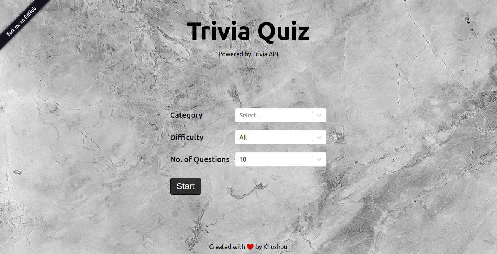
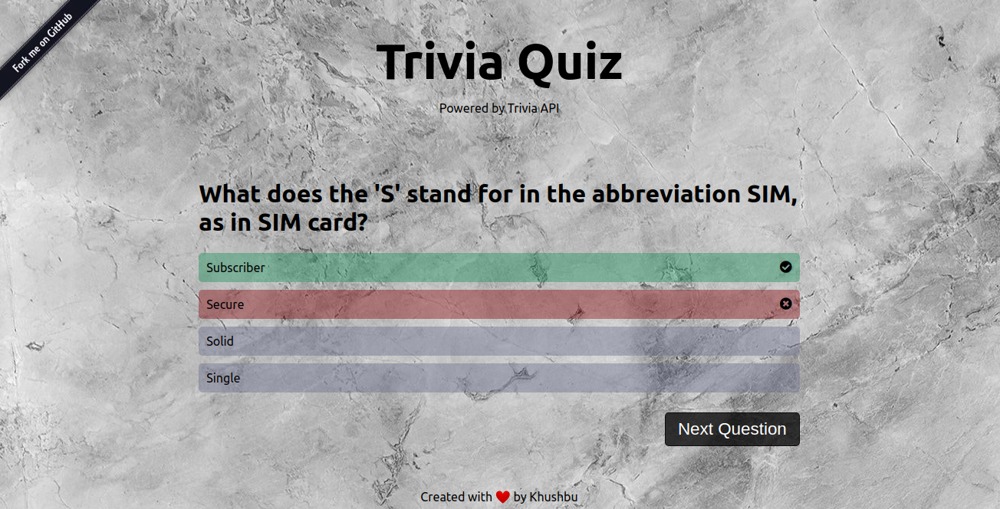
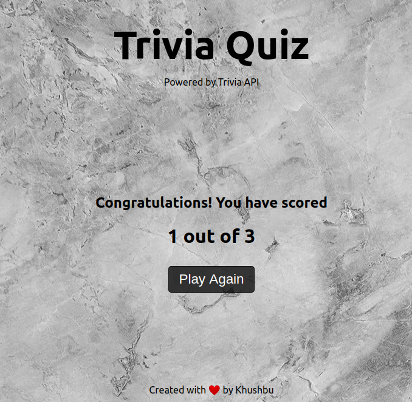
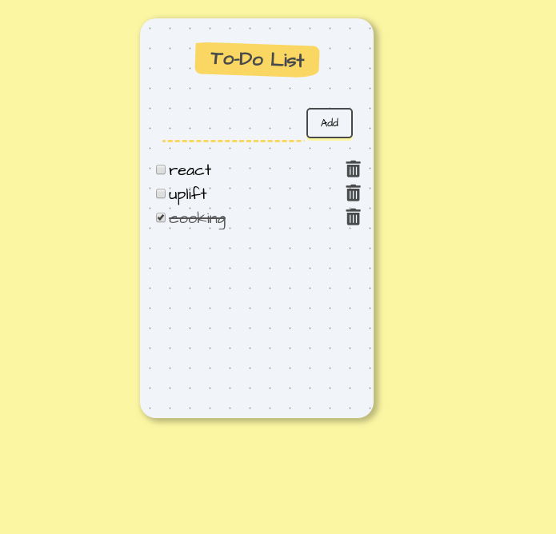

# Here are the two projects that I built in the first week(and a little more) after following the roadmap provided-

## I have learned and used basic functionalities of react like-

- class components
- lifecycle methods of class components
- state,setState and props
- functional components and hooks
- react router (went a little advance in this)

## [Quiz App](https://choukseykhushbu.github.io/trivia-quiz/)

- [Github Link](https://github.com/ChoukseyKhushbu/uplift-todo-app)

## [Todo App](https://choukseykhushbu.github.io/uplift-todo-app/)

- [Github Link](https://github.com/ChoukseyKhushbu/trivia-quiz)

