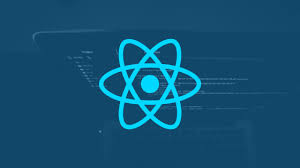

# React Learning-Roadmap : GirlScript Uplift Project

## Course Website

This is a project for Learning React under GirlScript Uplift Project.
Here we have Day to Day learning Links

## Features of this course

* Topics for learning
* Links to Topics official react Doc
* Links to other resources and materials
* On request mentor Support
* Practice Tasks

## Prerequisites:
* HTML5
* CSS3
* JavaScript(ES6)
* Basics of command line
* Knowledge of Git and Github

## Course Structure

### Week-1
DAY | Topics Covered 
------- | --- 
1     | [Introduction to React](Week%201/) 
2     | [Why Learning React ?](Week%201/) 
3     | [React vs other frameworks/libraries](Week%201/) 
4     | [ReactDom](Week%201/) 
5     | [ReactDom Vs Virtual Dom](Week%201/) 
6     | [Introduction to JSX for React ](Week%201/ )
7     | Task Submission and discussion 

### Week-2
DAY | Topics Covered 
------- | --- 
8     | [Rendering Elements in React](Week%202/) 
9     | [Introduction to Components](Week%202/) 
10     | [Types Of Components](Week%202/) 
11    | [Functional Components](Week%202/) 
12     | [Moving Components into separate files](Week%202/) 
13     | [States and Props in React ](Week%202/ ) 
14     | Task Submission and discussion